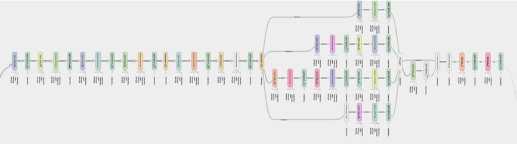

# sleep study

2020.4 - 2022.3 : code for master thethis
# Introduction


ENN の構造は上記の通り（InceptionV3 の一部を利用）


仮のデータを用いた実験結果

# Features

- <strong>nn による睡眠段階推定手法</strong>

# Branch

- master : 無駄なファイルを除いた一番軽量なブランチ（基本ここから切る）
- feature/psedo_data : 仮のデータを使った実験ブランチ（マージ・削除済み）
- feature/deep_learning : EUが原因で間違っているように見えるので、多層化により一致率向上を目指す
- feature/rnn : 時系列を考慮したNNの構築
- feature/sep_learning : 何のブランチか忘れた
- feature/data_selecting : 不確かさの低いデータを拾ってきて分類する

# Prefix

- feat: 新機能実装
- fix: バグの修正
- docs: ドキュメントのみの変更
- style: コード内のスタイルの変更（改行やフォーマットなどの機能以外の変更）
- refactor: 修正や新機能以外のコードの修正
- perf: パフォーマンス(実行速度)の向上
- test: 機能テストの追加
- chore: makefile,ライブラリ,その他の補足ツールの変更
  > （引用：[takadamalab](https://github.com/takadamalab)）

# Requirement

## windows

```bash
pip install -r requirements.txt
```

# Usage

```bash
git clone https://github.com/taiki-jp/sleep_study
cd sleep_study
# set your local environment path of "git" and "sleep"
# example
# os.environ["git"] = "%userprofile%/git"
# os.environ["sleep"] = "%userprofile%/sleep_study"
python main.py
```

# Note

- windows ubuntu 環境で動作確認済み
- gpu の設定をしていない場合エラーが出るかも

# Author

作成情報を列挙する

- 千住太希
- 電気通信大学
- s2030060@uec.ac.jp

# License

- under [MIT license](https://en.wikipedia.org/wiki/MIT_License).
